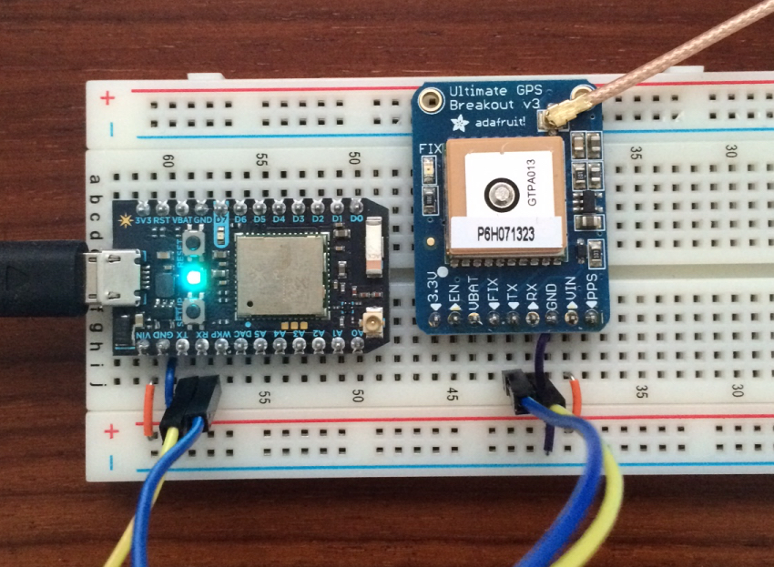

# electron

** Work in Progres. Maybe. **

This is a proof of concept for implementing a device which is [OwnTracks] compatible. The initial development is being done on a Particle Photon, and it is assumed that this can easily be ported to a Particle Electron when it becomes available. (We don't yet have an Electron.)



The resulting device will have (or not have) the following capabilities:

* JSON payloads compatible with [OwnTracks JSON](http://owntracks.org/booklet/tech/json/)
* No TLS, because the firmware doesn't support TLS.
* Configurable MQTT broker (address or hostname) and port.
* Configurable MQTT broker username and password.
* Configurable reporting interval
* Possibly configurable reporting after movement of _n_ meters.

Note that the absence of TLS is a severe issue!


An example published from our current firmware (186 octets per publish, give or take a few):

```json
{
  "_type": "location",
  "dist": 0.54,
  "alt": 177,
  "cog": 51,
  "tst": 1452187610,
  "temp": 23.02,
  "humid": 28.69,
  "lat": 48.854458,
  "lon": 2.333510,
  "vel": 1
}
```

Note also, that this prototype contains _temperature_ and _humidity_ values from an optional sensor we've experimentally added.


## Configuration

The firmware is pre-configured to the `test.mosquitto.org` broker on port `1883`. This can be changed by setting via the Particle cloud, the following:

```sh
#!/bin/sh

access_token=abababababababababababababababababababab
devid=nnnnnnnnnnnnnnnnnnnnnnnn
broker="mqtt.example.org:1883"
broker="192.168.1.220:9003"

curl https://api.particle.io/v1/devices/${devid}/setbroker \
	-d access_token="${access_token}" \
	-d arg="${broker}"
```

## Cloud variables

The firmware updates the following Particle variables:

* `location` contains a short JSON with the current `lat` and `lon`.

The content of these variables can be accessed via the Particle cloud as follows

```sh
#!/bin/sh

access_token=abababababababababababababababababababab
devid=nnnnnnnnnnnnnnnnnnnnnnnn
var="location"

curl "https://api.particle.io/v1/devices/${devid}/${var}?access_token=${access_token}"
```

An example:

```json
{
  "cmd": "VarReturn",
  "name": "location",
  "result": "{\"lat\":48.854458,\"lon\":2.333510}",
  "coreInfo": {
    "last_app": "",
    "last_heard": "2016-01-07T17:22:38.679Z",
    "connected": true,
    "last_handshake_at": "2016-01-07T17:04:08.239Z",
    "deviceID": "nnnnnnnnnnnnnnnnnnnnnnnn",
    "product_id": 6
  }
}
```

## Requirements / Credits

* [TinyGPS_SparkCore](https://github.com/krvarma/TinyGPS_SparkCore) by Krishnaraj Varma (GPL)
* [SparkJson](https://github.com/menan/SparkJson) by Menan Vadivel (MIT)
* [MQTT for Spark](https://github.com/hirotakaster/MQTT) by Hirotaka (MIT) **Note: we have provided several patches for this library**
* [HTU21D](https://github.com/romainmp/HTU21D) by romainp (GPL)

  [OwnTracks]: http://owntracks.org
