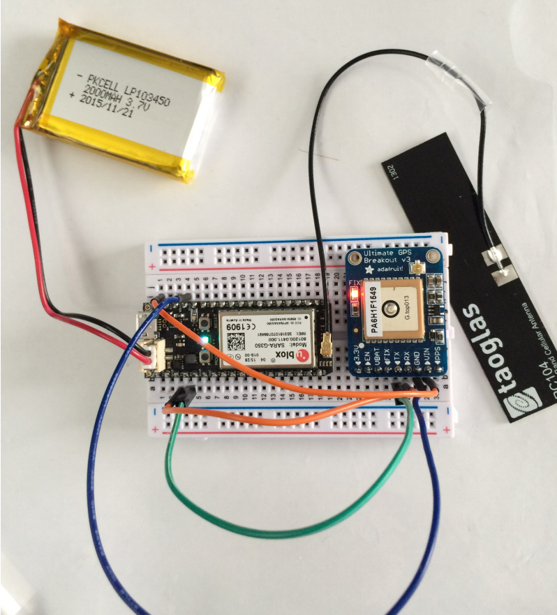
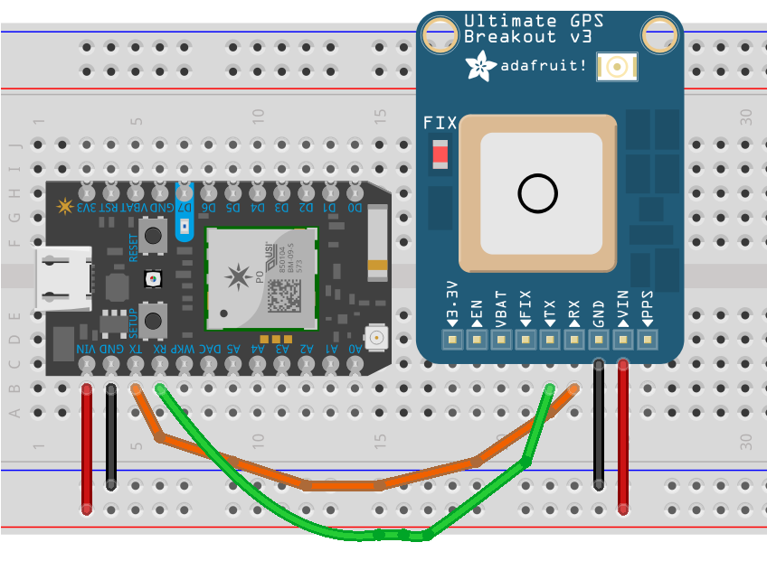

# electron

** Work in Progres. Maybe. **

This is a proof of concept for implementing a device which is [OwnTracks] compatible on a [Particle Electron](https://docs.particle.io/datasheets/electron-datasheet/).



The intention was to have the device report via MQTT (which is possible since the [v0.5.0-rc.1 firmware](https://github.com/spark/firmware/releases), but we've dropped this idea for a number of reasons:

* No TLS 
* The TCP traffic churns through the data plan
* possible instability

Instead, the Electron will publish a single Particle _variable_ named `status` with a CSV string in it containing

* timestamp (`tst`)
* latitude (`lat`)
* longitude (`lon`)
* battery level (`batt`)

A example:

```
1460104015,48.854458,2.333510,5.0,256.0
```

A backend program in Python periodically polls the `status` from the Particle Cloud via a REST call publishes the data to an MQTT broker in typical [OwnTracks JSON format](http://owntracks.org/booklet/tech/json/), with a `tid` constructed from the last two digits of the Electron's _deviceID_:

```json
{"_type": "location", "lon": 2.333510 "tid": "38", "batt": 5.0, "lat": 48.854458, "tst": 1460104015}
```

## Wiring





## Cloud variables

The firmware updates the following Particle variables:

* `status` contains the CSV described above

The content of these variables can be accessed via the Particle cloud as follows

```sh
#!/bin/sh

access_token=abababababababababababababababababababab
devid=nnnnnnnnnnnnnnnnnnnnnnnn

curl "https://api.particle.io/v1/devices/${devid}/status?access_token=${access_token}"
```

An example:

```json
{
  "cmd": "VarReturn",
  "name": "location",
  "result": "1460104015,48.854458,2.333510,5.0,256.0",
  "coreInfo": {
    "last_app": "",
    "last_heard": "2016-01-07T17:22:38.679Z",
    "connected": true,
    "last_handshake_at": "2016-01-07T17:04:08.239Z",
    "deviceID": "nnnnnnnnnnnnnnnnnnnnnnnn",
    "product_id": 6
  }
}
```

## Compiling

Compile the `src/` directory in the cloud; if you're on Unix/Linux you should be able to type `make`:

```
$ particle compile electron src/ --saveTo owntracks.bin

Compiling code for electron
...

Compile succeeded.
Saved firmware to: owntracks.bin
```

Then flash the resulting firmware file (e.g. `electron_firmware_1460118436052.bin`) to your Electron using 

```
particle flash --usb owntracks.bin
```

## Requirements / Credits

* [TinyGPS++](https://github.com/codegardenllc/tiny_gps_plus)

  [OwnTracks]: http://owntracks.org
